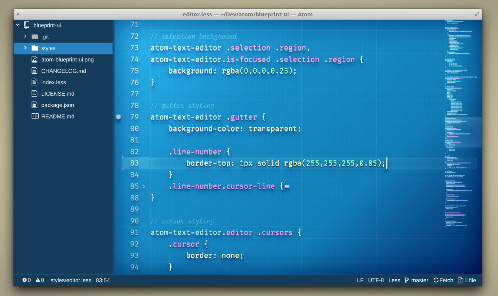
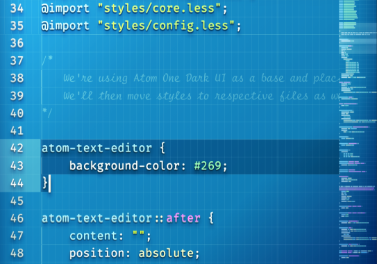
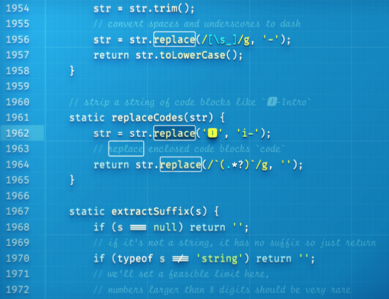
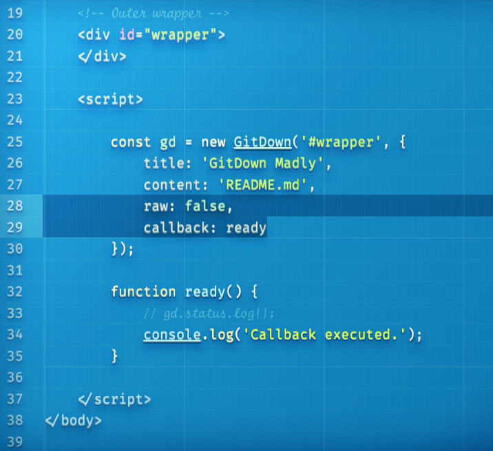

## Blueprint UI

A dark-ish blue UI theme for Atom that wants to look like a blueprint but also wants 3d-ish text effects. I know, silly right? The theme uses text shadows to emphasize code while comments blend legibly in the background.

Best used with Atom One Dark Syntax theme. Other syntax themes may expose how ugly it is inside.

> The font used in the screenshots is [Fira Code iScript](https://github.com/kencrocken/FiraCodeiScript).

FEATURES
* it's blue
* it's real pretty
* ensures CPU cycles are put to use
* text-shadows for everything except comments to help focus on code
* only looks good with Atom One Dark which helps focus instead of searching for syntax themes
* shoddy code ensures you can show off by submitting improvements

KNOWN BUGS
* extensive use of CSS effects ensures it can't be ported to VS Code
