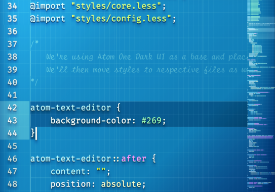

## Blueprint UI

A dark-ish UI theme that wants to look like a blueprint. It abuses modern CSS, making extensive use of gradients, patterns, blend modes, filter effects and othery CPU-hungry eye candy.

> The font used in the screenshot is [Fira Code iScript](https://github.com/kencrocken/FiraCodeiScript).

FEATURES
* it's blue
* it's real pretty
* ensures CPU cycles are put to use
* text-shadows for everything except comments to help focus on code
* only looks good with Atom One Dark which helps focus instead of searching for syntax themes
* shoddy code ensures you can show off by submitting improvements

KNOWN BUGS
* extensive use of CSS effects ensures it can't be ported to VS Code
